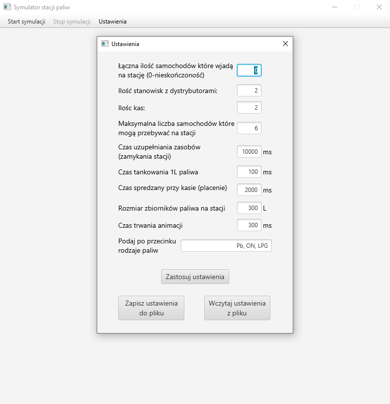
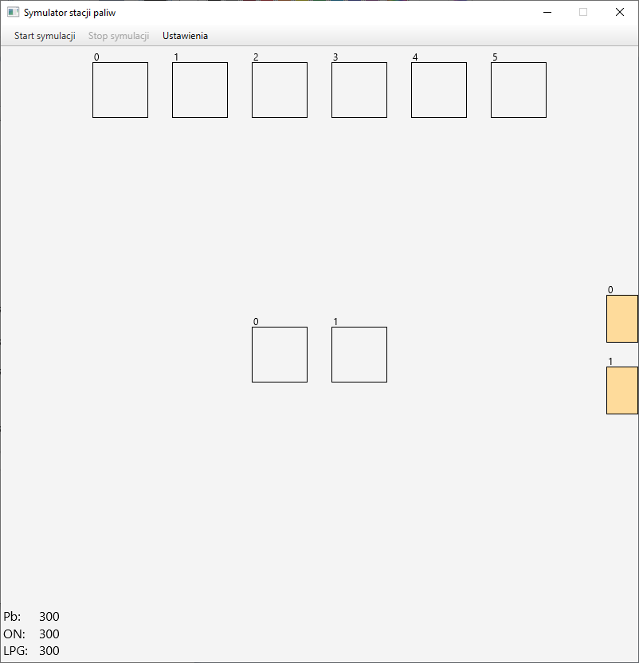
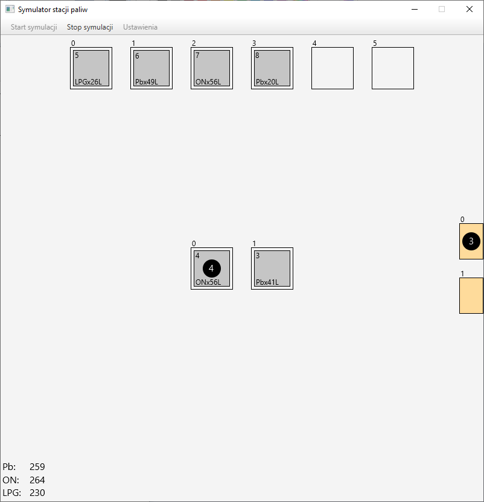

# Petrol station - simulation

## Description:

It is an multi-thread application that simulates the operation of a gas station, you can set all simulation values, stop and start the simulation. Built in java using javafx framework.

## Screenshots:

